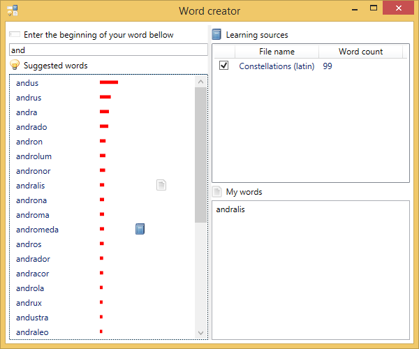

Word Creator
=

A small tool to invent new words or names.

How it works ?
-

It learns how words are composed from word lists, then suggests words beginning with the letters provided by the user.
The suggested words are coherent with the words from the learning sources. 

Suggested words are listed by order of probability, they can be saved in "My words". A symbol tells if a word is already in a learning source or in "My words".

If you wonder how it's implemented, see [Markov text generator on wikipedia](http://en.wikipedia.org/wiki/Markov_chain)

Why would someone need this ?
-

My wife used this tool to invent new names for her clothe models. She used existing model names as learning sources.